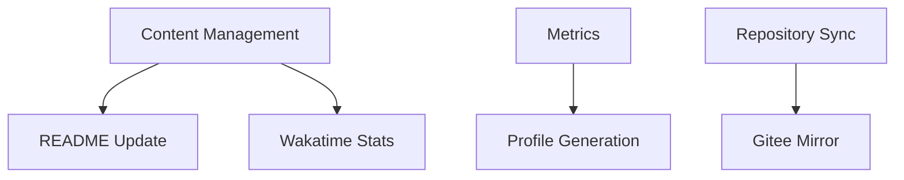

# 🚀 GitHub Workflows Documentation

## 📋 Overview

This directory contains optimized GitHub Actions workflows for automated content management, repository synchronization, and profile maintenance.

## 🗂️ Workflow Structure

### 📝 Content Management
- **`content-management.yml`** - Automated README updates and content synchronization
- **`metrics.yml`** - GitHub profile metrics and statistics generation
- **`waka-readme.yml`** - Wakatime statistics integration

### 🔄 Repository Operations  
- **`repository-sync.yml`** - Repository synchronization to external platforms
- **`gpt-translate.yml`** - AI-powered translation automation

### ⏰ Execution Schedule

| Workflow | Schedule | Purpose |
|----------|----------|---------|
| Content Management | 2:00 AM, 8:00 AM UTC | README & content updates |
| Metrics | 6:30 AM UTC | Profile metrics generation |
| Repository Sync | 1:00 AM UTC | Mirror to Gitee |
| Wakatime | 12:00 AM UTC | Time tracking stats |

## 🔧 Configuration

### Required Secrets
- `PERSONAL_GITHUB_TOKEN` - GitHub personal access token
- `BOT_GITHUB_TOKEN` - Bot account token for commits
- `WAKATIME_API_KEY` - Wakatime API key
- `GITEE_TOKEN` - Gitee SSH private key
- `GITEE_PRIVATE_KEY` - Gitee personal access token
- `OPENAI_API_KEY` - OpenAI API key for translations

### Environment Variables
- Timezone: `Asia/Shanghai`
- Default branch: `main`
- Bot user: `kubbot 🤖`

## 🎯 Optimization Features

### ✅ Implemented
- **Unified scheduling** - Optimized timing to avoid conflicts
- **Enhanced error handling** - Comprehensive failure reporting
- **Clear documentation** - Detailed comments and structure
- **Consistent naming** - Standardized file and job names
- **Status reporting** - Success/failure notifications

### 🔄 Workflow Dependencies

## 🚨 Troubleshooting

### Common Issues
1. **Token Expiration** - Check and refresh all API tokens
2. **Schedule Conflicts** - Workflows are timed to avoid overlaps
3. **Rate Limits** - Built-in delays and retry mechanisms

### Monitoring
- Check workflow status in Actions tab
- Review logs for detailed error information
- Monitor execution times and success rates

## 🔄 Maintenance

### Regular Tasks
- [ ] Review and update action versions quarterly
- [ ] Validate secret expiration dates
- [ ] Monitor workflow execution times
- [ ] Update documentation as needed

### Performance Metrics
- Average execution time: < 5 minutes per workflow
- Success rate target: > 95%
- Resource usage: Optimized for GitHub free tier

## 📞 Support

For issues or questions:
- Check workflow logs first
- Review this documentation
- Contact: @cubxxw

---
*Last updated: 2024-01-XX* 