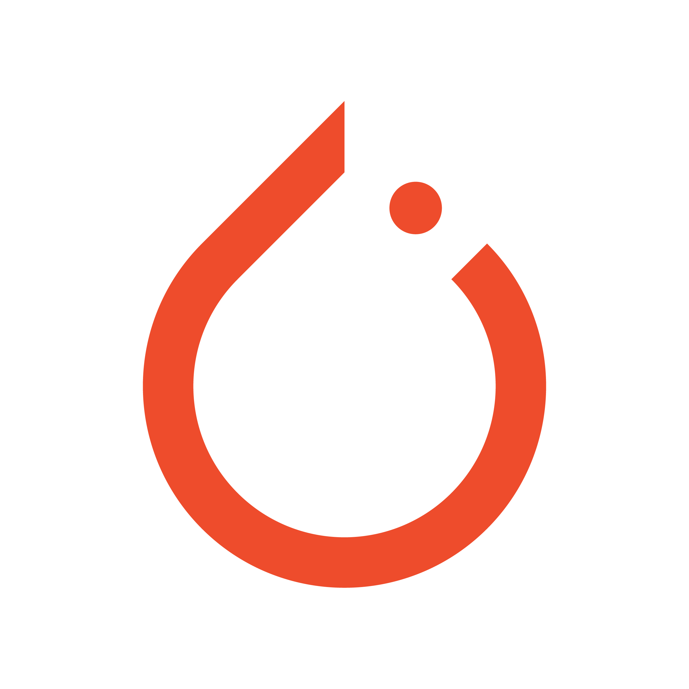

## Hi, 👋  I'm <a href="https://3293172751.github.io/resume/" target="_blank">🐻XiongXinWei</a> <a href="https://3293172751.github.io/resume/" />🔊</a>
<!--

-->
 

<!--  区块链  -->

<!--  leetcode  -->

<!--  CS  -->
  
<!--  C-UB  -->
  

  
 <em><b>I love connecting with different people</b> so if you want to say <b>hi, I'll be happy to meet you more!</b> :)</em>
</a>
 

<!--
**3293172751/3293172751** is a ✨ _special_ ✨ repository because its `README.md` (this file) appears on your GitHub profile.

Here are some ideas to get you started:

- 🔭 I’m currently working on ...
- 🌱 I’m currently learning ...
- 👯 I’m looking to collaborate on ...
- 🤔 I’m looking for help with ...
- 💬 Ask me about ...
- 📫 How to reach me: ...
- 😄 Pronouns: ...
- ⚡ Fun fact: ...
-->
<!--

-->
 

  <a href="https://github.com/3293172751" class="rich-diff-level-one">

   

  <a href="https://github.com/3293172751" class="rich-diff-level-one">

    
    <!-- &hide=issues
    
    -->
  </a>

  
  &emsp;
  
  &emsp;
   
  &emsp;
  
  &emsp;
  
  &emsp;
  
    
  <strong>Check out my work below!</strong>
   

<h2></h2>

 
<!-- stackoverflow profile

-->

<!-- 
#### Platform&Tools

   

   

**Languages and Frameworks**

<code></code>
<code></code>
<code></code>
<code></code>
<code></code>
<code></code>
<code></code>
<code></code>

**Tools and Environments**

<code></code>
<code></code>
<code></code>
<code></code>
<code></code>
<code></code>
<code></code>
<code></code>
<code></code>
<code></code>

 
 <figure><embed src="https://wakatime.com/share/@3293172751/d229e6d8-525a-4de8-80d2-04b78aa7d04a.svg"></embed></figure>
-->

###  📊I spend my time this year💻:

<!-- If you like what I do, 👉👈check out my blog☕ you are welcome 🍰 cake please 🥺🤺💕  -->

🚧 **My Todoist Stats: ⬇️👀** 
<!--
&nbsp;&nbsp;&nbsp;&nbsp;&nbsp; 
 &nbsp;&nbsp;&nbsp;&nbsp;&nbsp;
-->

